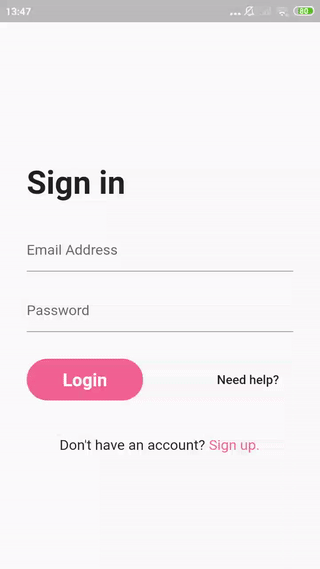
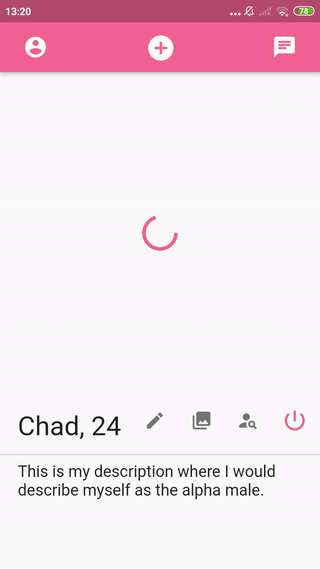
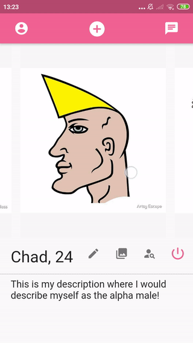

# Dating_app

## Introduction

Dating app inspired by Tinder. Written in Flutter (BLoC as architecture), uses Firebase as a backend (backend functions written in JavaScript).

## Features

- Signin and Signup functionality
- Setting up user profile (caption, photos, discovery settings etc.)
- Discovering people near your location based on your discovery settings (age, gender, distance)
- Accepting or rejecting discovered users
- Managing your matches (users accepted by you who accepted you as well)
- Conversating with matched users

## App Preview

All women images used in demonstration come from website www.thispersondoesnotexist.com

 \
 \
 
